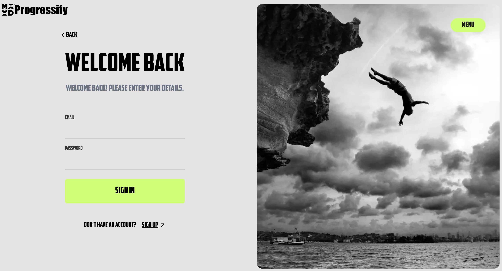
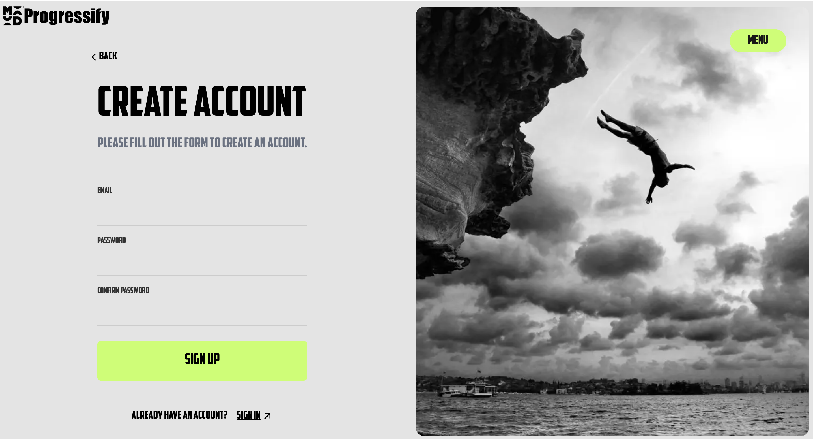

# Progressify

Progressify is a web application designed to help users track their lessons and progress in an organized and efficient way. The platform allows users to log in, sign up, and stay updated with their personal progress, all while providing a smooth and interactive user experience with animations powered by Framer Motion.

## Live Demo
Visit [https://progressify-theta.vercel.app/](https://progressify-theta.vercel.app/) to see the app in action.

## Screenshots

### Top Page


### Login Page


### Register Page


### Menu Open

## Features
- **Responsive Design**: The application is built to adapt seamlessly across devices using CSS media queries and dynamic layouts.
- **Authentication**: Users can register for an account and log in to access their personalized progress dashboard.
- **Animated Transitions**: Smooth, visually appealing transitions and animations, created using Framer Motion, enhance user experience.
- **Interactive Buttons**: Hover effects and animations are applied to interactive elements such as buttons to improve engagement.
- **Image Backgrounds**: A visually rich layout with responsive images that fit and adapt to different screen sizes.
  
## Tech Stack
- **Frontend**: React.js, Next.js, TypeScript
- **Styling**: SCSS for modular and maintainable styling
- **Animations**: Framer Motion for seamless animations and transitions
- **State Management**: React hooks (useState) for managing component state
- **Next.js Features**: Client-side rendering, dynamic imports

## How to Run Locally

1. **Clone the repository**
    ```bash
    git clone https://github.com/yourusername/progressify.git
    cd progressify
    ```

2. **Install dependencies**
    ```bash
    npm install
    ```

3. **Start the development server**
    ```bash
    npm run dev
    ```

4. Open your browser and go to `http://localhost:3000` to view the app.

## Folder Structure
- `components/`: Contains React components like the `Hero`, `LoginForm`, and `RegisterForm`.
- `pages/`: Includes Next.js page files (e.g., `index.tsx`).
- `public/`: Contains static assets such as images.
- `styles/`: SCSS styling files for modular, responsive, and scalable design.

## Responsive Design
This project is optimized for various screen sizes, ensuring a consistent and smooth experience on mobile, tablet, and desktop devices. The layout adjusts based on the viewport width, ensuring the application is usable and aesthetically pleasing on all devices.

## Contributing
Feel free to fork this project and submit pull requests. If you encounter any issues or have suggestions for improvements, please open an issue on GitHub.

## License
MIT License. See [LICENSE](LICENSE) for more details.
